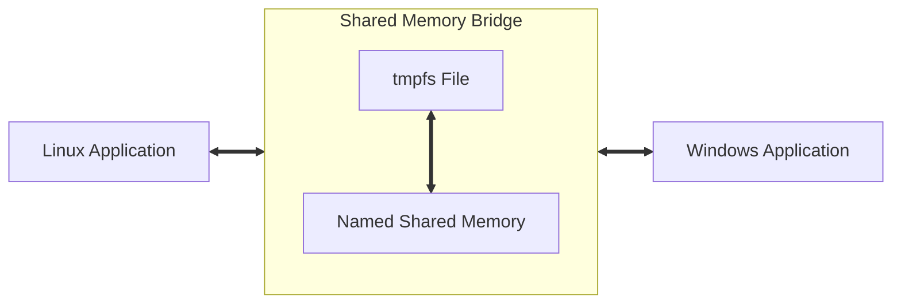

[](https://github.com/poljar/shm-bridge/actions/workflows/ci.yml)

# Shared memory bridge

Share memory between a Windows application running under Wine/Proton and Linux.

This allows you to expose [named shared memory] a Windows application uses under
Linux. The Linux application can then [`mmap(2)`] the named shared memory file and
read its data.

## History

This is a Rust port of [`oculus-wine-wrapper`]. The main difference here is
that [`oculus-wine-wrapper`] exposed an existing `/dev/shm` backed file, that
the `oculusd` daemon creates, as [named shared memory] using Wine.

We on the other hand go the other direction. We want to re-expose named shared
memory a Windows executable creates under Linux. For this to work, we first
create a file on a [`tmpfs`] file system, then we create the named shared memory
mapping, backed by the [`tmpfs`] file. We need to create the named shared memory
before the Windows executable does, then it will just reuse the, now [`tmpfs`]
backed named shared memory as if it created it itself.



Once the Windows application uses the named shared memory we created, the data
the Windows application exposes using the named shared memory will be found in
the [`tmpfs`] file as well. Linux applications then can just open and [`mmap(2)`]
the [`tmpfs`] file to read shared memory.

## Installation 

The installation of `shm-bridge` requires [Rust], we're going to assume that you
have already [installed Rust][rust-install]. Since this is a Windows application
that is meant to be run under Wine/Proton you'll have to add a Windows target to
your Rust installation.

```bash
$ rustup target add x86_64-pc-windows-gnu
```

After the target has been installed, `shm-bridge` can be installed using
[`cargo`]. From the root directory of the project, launch:

```bash
$ cargo install
```

## Usage

The bridge requires to be run under Wine or Proton, it's recommended to install
[`protontricks`] for ease of use.


The bridge should be launched inside the container of the application:

```bash
$ protontricks-launch --appid APPID shm-bridge.exe
```

### Finding the application ID

To find out the `APPID` you can use `protontricks` itself:

```bash
$ protontricks -s "Assetto Corsa"

Found the following games:
Assetto Corsa Competizione (805550)

To run Protontricks for the chosen game, run:
$ protontricks APPID COMMAND

NOTE: A game must be launched at least once before Protontricks can find the game.
```

### Launching the bridge

Now you can launch the bridge in the container of the game:

```bash
$ protontricks-launch --appid 805550 shm-bridge.exe

Found a tmpfs filesystem at /dev/shm/
Created a tmpfs backed mapping for acpmf_crewchief with size 15660
Created a tmpfs backed mapping for acpmf_static with size 2048
Created a tmpfs backed mapping for acpmf_physics with size 2048
Created a tmpfs backed mapping for acpmf_graphics with size 2048
All mappings were successfully created, press CTRL-C to exit.

```

## Supported titles

The shared memory bridge currently supports the following titles:

* [Assetto Corsa][ac]
* [Assetto Corsa Competizione][acc]

### Assetto Corsa / Assetto Corsa Competizione

To access the shared memory you can [`shm_open(3)`] and [`mmap(2)`] the files
listed in the output of `shm-bridge.exe`.

For example, if we run the bridge we will see an output like:

```
...
Found a tmpfs filesystem at /dev/shm/
Created a tmpfs backed mapping for acpmf_static with size 2048
...
```

This tells us that we can open a file under `/dev/shm/acpmf_static` and map the
memory into our process. To interpret the bytes in the file, you'll have to use
structures from the games SDK. The [simapi] project contains definitions of such
structures, alternatively the Rust library [simetry] contains them as well.

To quickly test if the bridge correctly works you can also use some applications
that use [simapi], for example [gilles]. Another option would be to use one of
the examples in the [simetry] repository:

```bash
$ cargo run --example assetto_corsa_competizione_get_data

```

**Warning**: This example currently requires the usage of a fork of [simetry],
which can be found at: https://github.com/poljar/simetry/

## Development

To modify and develop `shm-bridge` you'll have to install [Rust] and the Windows
Rust target, please take a look at the [installation](#installation) section.

Cargo has been set up to use the `x86_64-pc-windows-gnu` target by default. This
means that, once the correct target has been installed, `cargo
check`, `build`, or `install` work as expected. Wine has been set up as the
default runner, which makes `cargo run` work.

```bash
$ cargo run
   Compiling shm-bridge v0.1.0 (/home/poljar/werk/simracing/shm-bridge)
    Finished dev [unoptimized + debuginfo] target(s) in 0.36s
     Running `wine target/x86_64-pc-windows-gnu/debug/shm-bridge.exe`
Found a tmpfs filesystem at /dev/shm/
Created a tmpfs backed mapping for acpmf_crewchief with size 15660
Created a tmpfs backed mapping for acpmf_static with size 2048
Created a tmpfs backed mapping for acpmf_physics with size 2048
Created a tmpfs backed mapping for acpmf_graphics with size 2048
All mappings were successfully created, press CTRL-C to exit.
```

## Similar/Related Projects

A couple of similar projects exists in various languages, they all seem to
require multiple binaries, one Linux binary to create the `/dev/shm` backed files
and one Windows binary to create the named shared memory utilizing the file.

* [simshmbridge] - Wrapper programs to map shared memory from Linux for access
                   by Wine and Proton.
* [wineshm-go] - This package retrieves a Wine shared memory map file descriptor
                 and makes it available in Linux.
* [wine-linux-shm-adapter] - Wrapper programs to map shared memory from a Wine
                             process into a Linux process.

## License

Licensed under [The MIT][license] License.

## Copyright

Copyright © 2024, [Damir Jelić](mailto:poljar@termina.org.uk).

[`protontricks`]: https://github.com/Matoking/protontricks/
[license]: https://github.com/poljar/shm-bridge/blob/main/LICENSE
[named shared memory]: https://learn.microsoft.com/en-us/windows/win32/memory/creating-named-shared-memory
[`oculus-wine-wrapper`]: https://github.com/feilen/oculus-wine-wrapper/
[ac]: https://store.steampowered.com/app/805550/Assetto_Corsa_Competizione/
[acc]: https://store.steampowered.com/app/805550/Assetto_Corsa_Competizione/
[`tmpfs`]: https://www.kernel.org/doc/html/latest/filesystems/tmpfs.html
[`mmap(2)`]: https://man7.org/linux/man-pages/man2/mmap.2.html
[simshmbridge]: https://github.com/spacefreak18/simshmbridge
[wineshm-go]: https://github.com/LeonB/wineshm-go
[wine-linux-shm-adapter]: https://github.com/Spacefreak18/wine-linux-shm-adapter
[rust-install]: https://www.rust-lang.org/tools/install
[Rust]: https://www.rust-lang.org/
[`cargo`]: https://doc.rust-lang.org/cargo/
[`shm_open(3)`]: https://man7.org/linux/man-pages/man3/shm_open.3.html
[simapi]: https://github.com/spacefreak18/simapi
[simetry]: https://github.com/adnanademovic/simetry/
[gilles]: https://github.com/Spacefreak18/gilles
